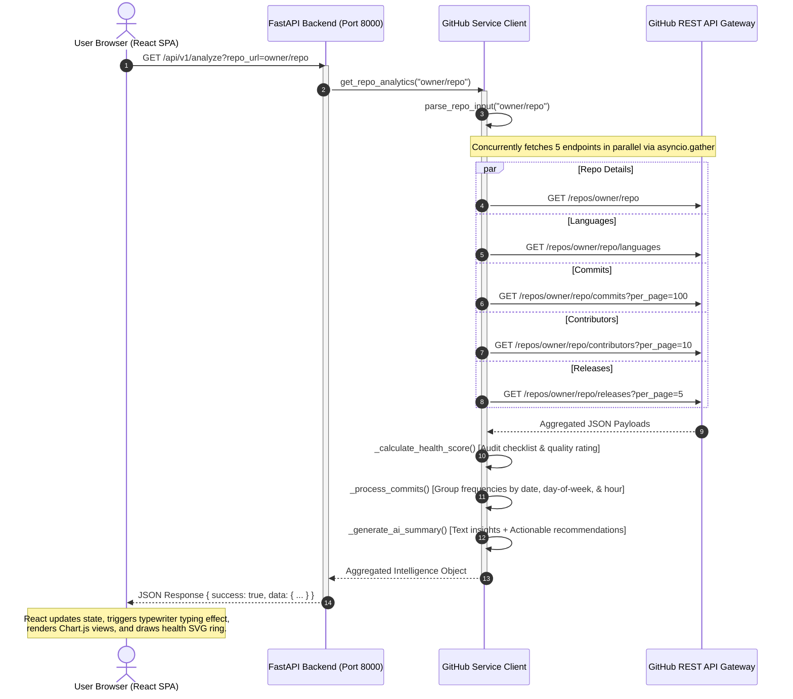

# GitAnalyzer Technical Documentation & Architecture Guide

This document provides a comprehensive overview of **GitAnalyzer**, explaining the project request lifecycle, frontend/backend communication flow, directory structure, and detailed descriptions of what each file does.

---

## 1. System Architecture & Request Lifecycle

GitAnalyzer is built using a **decoupled architecture**:
1. **Frontend**: A single-page application (SPA) built with **React**, **Vite**, and **Material-UI (MUI)**. It utilizes **Chart.js** for high-fidelity interactive visual charts and custom SVG paths for animated gauges.
2. **Backend**: An asynchronous ASGI microservice built with **FastAPI**. It handles GitHub API aggregation, repository quality audit computation (Health Score), and text analytics modeling (AI Summary).

The sequence diagram below visualizes the life cycle of a repository analysis request:



---

## 2. Directory Structure

```
Githun_analiser/
├── .dockerignore
├── .env                  # Local secret keys & configurations (git-ignored)
├── .env.example          # Template environment configurations
├── .gitignore
├── ARCHITECTURE.md       # Technical documentation (This file)
├── Dockerfile            # Multi-stage production container build
├── README.md             # Project introductory and local boot instructions
├── requirements.txt      # Python dependencies
├── app/                  # Python FastAPI Backend Folder
│   ├── __init__.py
│   ├── config.py         # Config schema parser (Pydantic settings)
│   ├── exception_handlers.py # Standardized API error payloads
│   ├── main.py           # Application entrypoint & catchall SPA serving
│   ├── routers/
│   │   ├── __init__.py
│   │   └── analyzer.py   # REST controller for /analyze
│   └── services/
│       ├── __init__.py
│       └── github_service.py # Core intelligence & GitHub service aggregator
└── frontend/             # React MUI Frontend Folder
    ├── index.html        # SPA root element index wrapper
    ├── package.json      # NPM dependencies & build commands
    ├── vite.config.js    # Vite compiler & local dev API proxy settings
    ├── src/
    │   ├── main.jsx      # React launcher & Theme injector
    │   ├── theme.js      # Global MUI Dark glassmorphic theme details
    │   ├── index.css     # Orb layouts, scrolling, and keyframe animations
    │   └── App.jsx       # Single-component UI dashboard state orchestrator
```

---

## 3. Detailed File Breakdown

### Root Directory (Configurations & Containerization)

#### 1. [requirements.txt](file:///c:/Users/kalan/OneDrive/Desktop/Githun_analiser/requirements.txt)
Defines Python packages required for the FastAPI backend:
- `fastapi`: Core framework for REST routes.
- `uvicorn`: ASGI server that boots python apps.
- `pydantic-settings`: Parses and validates project environment values.
- `httpx`: Asynchronous client supporting parallel non-blocking requests.
- `python-dotenv`: Backport support mapping `.env` into OS values.

#### 2. [Dockerfile](file:///c:/Users/kalan/OneDrive/Desktop/Githun_analiser/Dockerfile)
Implements a secure, optimized **multi-stage build**:
- **Stage 1 (Node Compilers)**: Boots a `node:20-alpine` sandbox, installs NPM assets, and compiles the React SPA to `frontend/dist/`.
- **Stage 2 (Python Runtime)**: Boots a `python:3.11-slim` runner, installs backend packages, copies compiled SPA folders (`frontend/dist/`) from Stage 1, and boots Uvicorn on port `8000`.

#### 3. [.dockerignore](file:///c:/Users/kalan/OneDrive/Desktop/Githun_analiser/.dockerignore)
Optimizes container packaging by preventing local caches, Node modules, virtual environments (`venv`), local `.env` files, and local build bundles from leaking into the container layers.

---

### Backend Service Code (`app/`)

#### 4. [app/main.py](file:///c:/Users/kalan/OneDrive/Desktop/Githun_analiser/app/main.py)
The primary backend initializer:
- Configures global middleware (CORS headers).
- Registers backend router endpoints (`analyzer.router`).
- **SPA catchall server**: Detects compiled React assets at `frontend/dist/`. Mounts `/assets` routes to serve static files, and captures all non-API routing calls to return the React `index.html` file (allowing React Router/SPA flow).

#### 5. [app/config.py](file:///c:/Users/kalan/OneDrive/Desktop/Githun_analiser/app/config.py)
Defines config structures using Pydantic's `BaseSettings`. It automatically maps OS env keys into variables (like `GITHUB_TOKEN`, `PORT`) and assigns default fallbacks.

#### 6. [app/exception_handlers.py](file:///c:/Users/kalan/OneDrive/Desktop/Githun_analiser/app/exception_handlers.py)
Handles exception tracking:
- Catches validation and general errors to output unified JSON error payloads (`{ success: false, error: "...", message: "..." }`).
- Intercepts GitHub specific calls (e.g. rate limit `403` hits, private repo `404` errors) to return helpful advice to the frontend user.

#### 7. [app/routers/analyzer.py](file:///c:/Users/kalan/OneDrive/Desktop/Githun_analiser/app/routers/analyzer.py)
Handles requests pointing to `/api/v1/analyze?repo_url=...`. Standardizes endpoints, validates query inputs, triggers `github_service.get_repo_analytics()`, and responds with structured data models.

#### 8. [app/services/github_service.py](file:///c:/Users/kalan/OneDrive/Desktop/Githun_analiser/app/services/github_service.py)
The backend core containing the HTTP request client and computation utilities:
- **String Token Parser**: Resolves search formats (full URLs or raw `owner/repo` formats) into normalized tokens.
- **Asynchronous Concurrent Dispatcher**: Employs `asyncio.gather` to retrieve data from five GitHub API paths in parallel, preventing route blocking.
- **Fault-Tolerant Fallbacks**: Catches minor sub-service errors. For example, if a repository contains no version releases, it logs the exception but allows the rest of the languages, commits, and contributors dashboard to render successfully.
- **Health Auditor**: Evaluates codebases on stars-to-issues proportions, license documentation, description details, and commit frequencies to compute a rating from `0` to `100%`.
- **AI Text Insights Engine**: Performs structured metadata evaluations (evaluating language weights, release cycles, work hours, and contributor concentration) to generate custom text summaries and three actionable optimization suggestions.

---

### React Frontend Code (`frontend/`)

#### 9. [frontend/package.json](file:///c:/Users/kalan/OneDrive/Desktop/Githun_analiser/frontend/package.json)
Lists frontend dependency requirements (`@mui/material`, `chart.js`, `lucide-react`, `react-chartjs-2`) and defines dev commands and build compilers.

#### 10. [frontend/vite.config.js](file:///c:/Users/kalan/OneDrive/Desktop/Githun_analiser/frontend/vite.config.js)
Bundles React dependencies. Configures an **API proxy redirection** so that when developer instances query `/api`, requests are redirected automatically to your local backend server at `http://127.0.0.1:8000`.

#### 11. [frontend/index.html](file:///c:/Users/kalan/OneDrive/Desktop/Githun_analiser/frontend/index.html)
Main page framework shell that imports external Google Fonts (Outfit, Inter) and defines the root DOM mounting element node.

#### 12. [frontend/src/main.jsx](file:///c:/Users/kalan/OneDrive/Desktop/Githun_analiser/frontend/src/main.jsx)
Initializes React, injects the custom glassmorphism theme, and boots the main `App` view inside the browser.

#### 13. [frontend/src/theme.js](file:///c:/Users/kalan/OneDrive/Desktop/Githun_analiser/frontend/src/theme.js)
Declares the dark Material-UI theme settings:
- Base Background: Deep Space Obsidian (`#090d16`).
- Card Surfaces: Glassmorphic transluscent overlays (`rgba(15, 23, 42, 0.45)` with `backdrop-filter: blur(16px)`).
- Typography: outfit (headings) and Inter (body).
- Color Accents: Teal `#2dd4bf`, Violet `#a78bfa`, and Coral Pink `#fb7185`.

#### 14. [frontend/src/index.css](file:///c:/Users/kalan/OneDrive/Desktop/Githun_analiser/frontend/src/index.css)
Injects supplementary layout styles:
- Scrolling configurations.
- Custom glowing, floating background decoration shapes.
- Keyframe slide animations.

#### 15. [frontend/src/App.jsx](file:///c:/Users/kalan/OneDrive/Desktop/Githun_analiser/frontend/src/App.jsx)
The centralized Single Page Application controller:
- Manages local UI states (search inputs, loaders, errors, tab indexes, typewriter status).
- Performs async fetch requests pointing to `/api/v1/analyze?repo_url=...`.
- Houses the typewriter typing animation engine for the AI Repository Summary.
- Coordinates the structured responsive layout:
  - **Header Area**: Repo name, license and size tags stacked above, with a single horizontal row of animated statistic widgets (Stars, Forks, Watchers, Issues) positioned below.
  - **Left Column (`lg={4}`)**:
    - **Languages Card**: Displays Chart.js Doughnut visualization mapping language shares.
    - **Repository Health**: Shows computed rating gauge inside an animated SVG circle and details audit checklist items.
    - **Top Contributors**: Shows developer list sorted by commit contributions.
  - **Right Column (`lg={8}`)**:
    - **AI Repository Summary**: Renders typewriter text block and list of recommendations.
    - **Commit Insights**: Tabbed charts switcher containing:
      1. *Timeline*: Line chart of recent 100 commits frequency.
      2. *Weekly Pulse*: Radar chart of commits grouped by day of the week.
      3. *Hourly Activity*: Bar chart of commits grouped by hour of the day.
    - **Feeds Row**: Recent Commits list and Latest Releases feed sitting side-by-side.
